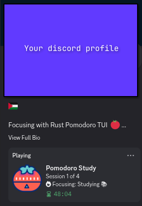

# Pomodoro TUI

A terminal-based Pomodoro timer written in Rust, with Discord Rich Presence integration, YouTube background music support, and themeable Vim-style navigation.

## Features

- **Discord Rich Presence** — Shows a live countdown and pause status on your Discord profile.
- **YouTube BGM Importer** — Download and play background music directly from YouTube.
- **Vim-style navigation** — Full support for `HJKL` and arrow keys.
- **Custom themes** — Cyan, Magenta, Green, Yellow, Red.
- **System notifications** — Alerts when a session or break ends.
- **Flexible timers** — Set any duration for sessions and breaks.
- **Lightweight** — Built in Rust, uses under 10MB of RAM.

## Screenshots

### Main Menu


### Session Setup
Choose your activity, duration, and number of sessions.

| Duration Selection | Session Count |
| :---: | :---: |
|  |  |

### Focus Mode & Discord Integration
| Focus Gauge | Discord Status |
| :---: | :---: |
|  |  |

## Installation

### Arch Linux (AUR)

```bash
yay -S pomodoro-tui
```

Run it with `pomo`.

### Linux & macOS (one-line installer)

```bash
curl -sSL https://raw.githubusercontent.com/Hxb8/rust-pomo-discord/main/install.sh | bash
```

### Cargo

```bash
cargo install pomodoro-tui-discord
```

### Windows

1. Go to the [Releases](https://github.com/Hxb8/rust-pomo-discord/releases) page.
2. Download `pomo-windows.zip`.
3. Extract and run `pomo.exe`.

## Requirements

To use the YouTube import feature, make sure these are installed:

- `yt-dlp`
- `ffmpeg`

## Controls

| Key | Action |
|-----|--------|
| `Space` | Play / Pause |
| `H` / `Left` | Back / Stop |
| `L` / `Right` / `Enter` | Select / Next |
| `J` / `K` / Arrows | Navigate / Adjust |
| `S` | Settings |
| `I` | Import BGM |
| `Q` / `Esc` | Quit |

## Privacy & Security

This application is open source. It communicates with Discord only locally via IPC. No personal data is collected or transmitted to any external server.

## Contributing

Bug reports and feature requests are welcome — open an issue or submit a pull request.

## Star History

<a href="https://www.star-history.com/?repos=Hxb8%2Frust-pomo-discord&type=date&legend=top-left">
  <picture>
    <source media="(prefers-color-scheme: dark)" srcset="https://api.star-history.com/chart?repos=Hxb8/rust-pomo-discord&type=date&theme=dark&legend=top-left" />
    <source media="(prefers-color-scheme: light)" srcset="https://api.star-history.com/chart?repos=Hxb8/rust-pomo-discord&type=date&legend=top-left" />
    
  </picture>
</a>

## Author

Maintained by [Islam / Hxb8](https://github.com/Hxb8).
