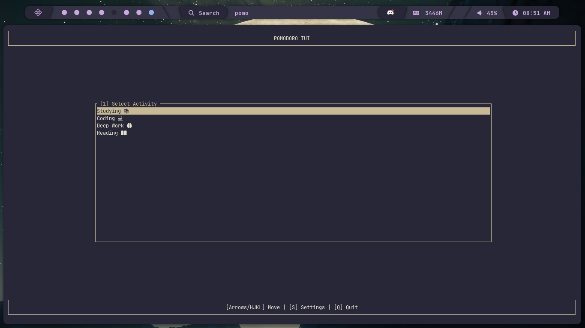
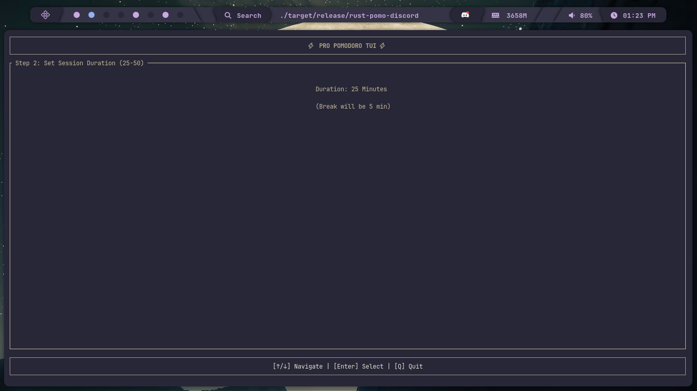
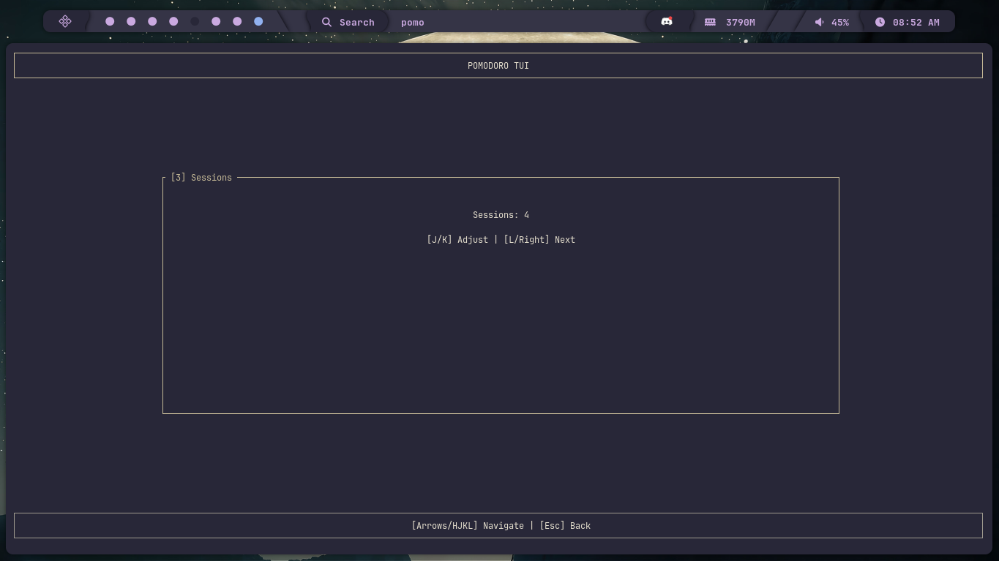
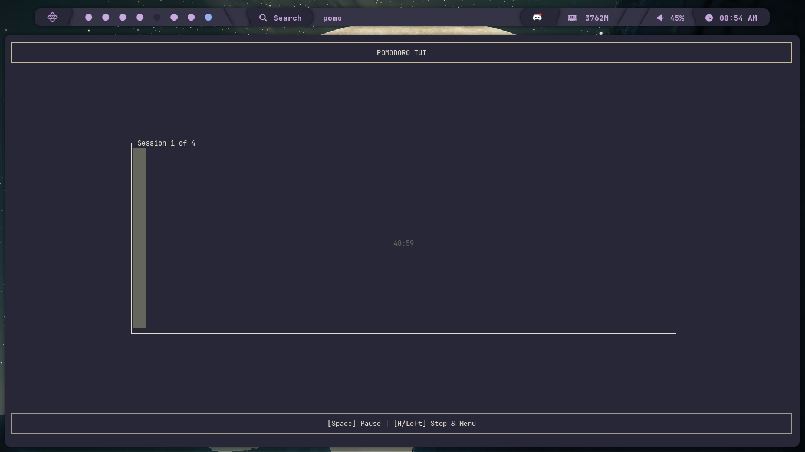

# Termdoro

A terminal-based Pomodoro timer written in Rust with background music, progress tracking, and Vim-style navigation.

## Features

- **Pomodoro Timer** — Configurable focus duration and session count with automatic work/break cycles.
- **Activity Management** — Create, select, and track multiple custom activities.
- **Background Music** — Play MP3 background music during focus sessions with volume control and mute.
- **YouTube BGM Importer** — Download and import music directly from YouTube URLs.
- **Built-in Rain Sound** — Ships with a rain sound effect for focus and relaxation.
- **Session Resume** — Automatically save and resume interrupted sessions on restart.
- **Progress Dashboard** — Track total focus time, sessions completed, and per-activity statistics with time period filtering (All Time, Today, This Week, This Month).
- **Detailed Activity Stats** — View completed vs incomplete sessions, average session length, and last session date.
- **Custom Themes** — 5 color themes: Cyan, Magenta, Green, Yellow, Red.
- **System Notifications** — Desktop alerts when a focus session or break ends.
- **Vim-style Navigation** — Full `HJKL` and arrow key support throughout the app.
- **Persistent Configuration** — Settings, activities, theme, and volume are saved automatically.
- **Lightweight** — Built in Rust, TUI-based, minimal resource usage.

## Screenshots

### Main Menu


### Session Setup
Choose your activity, duration, and number of sessions.

| Duration Selection | Session Count |
| :---: | :---: |
|  |  |

### Focus Mode


## Installation

### Linux & macOS (one-line installer)

```bash
curl -sSL https://raw.githubusercontent.com/Hxb8/Termdoro/main/install.sh | bash
```

### Cargo

```bash
cargo install termdoro
```

## Requirements

To use the YouTube import feature, make sure these are installed:

- `yt-dlp`
- `ffmpeg`

## Controls

| Key | Action |
|-----|--------|
| `Space` | Play / Pause |
| `H` / `Left` | Back / Stop |
| `L` / `Right` / `Enter` | Select / Next |
| `J` / `K` / Arrows | Navigate / Adjust |
| `S` | Settings |
| `I` | Import BGM |
| `M` | Mute / Unmute |
| `+` / `-` | Volume Up / Down |
| `A` | Add Activity |
| `D` | Dashboard |
| `Q` / `Esc` | Quit |

## Contributing

Bug reports and feature requests are welcome — open an issue or submit a pull request.

## Star History

<a href="https://www.star-history.com/?repos=Hxb8%2FTermdoro&type=date&legend=top-left">
  <picture>
    <source media="(prefers-color-scheme: dark)" srcset="https://api.star-history.com/chart?repos=Hxb8/Termdoro&type=date&theme=dark&legend=top-left" />
    <source media="(prefers-color-scheme: light)" srcset="https://api.star-history.com/chart?repos=Hxb8/Termdoro&type=date&legend=top-left" />
    
  </picture>
</a>

## Author

Maintained by [Islam / Hxb8](https://github.com/Hxb8)
